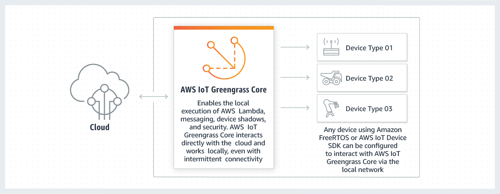
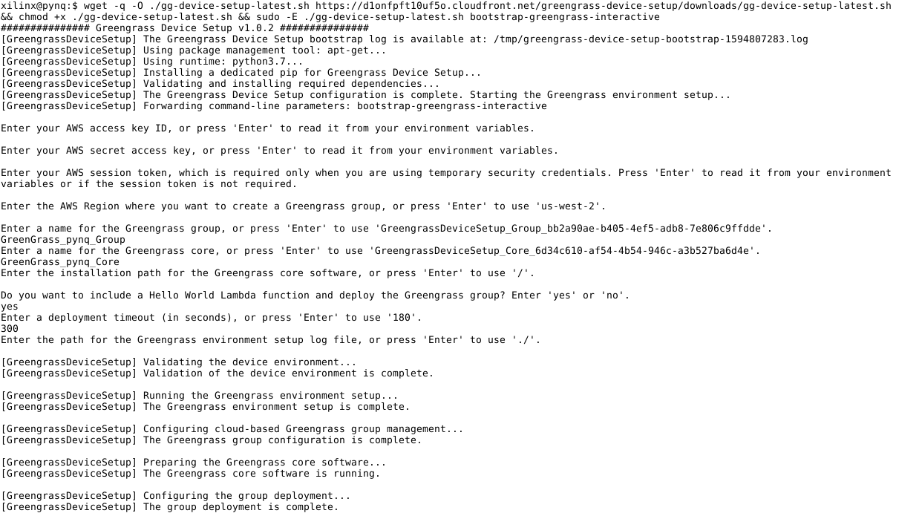
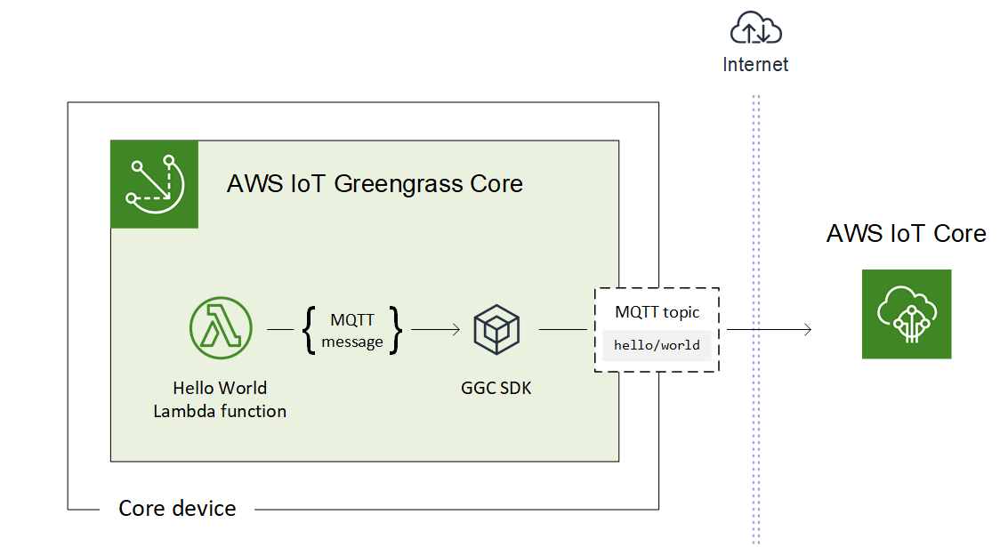
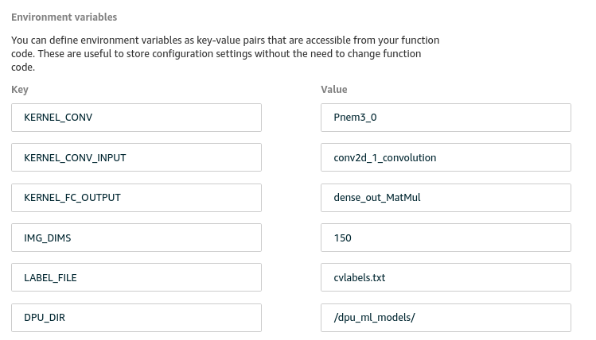
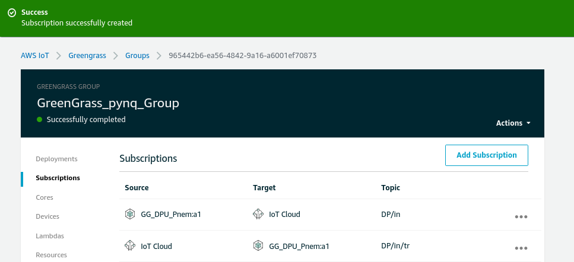
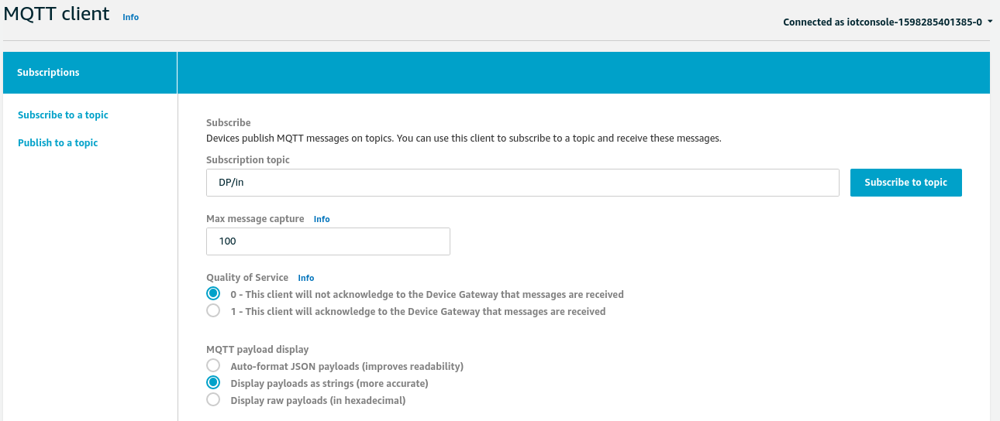
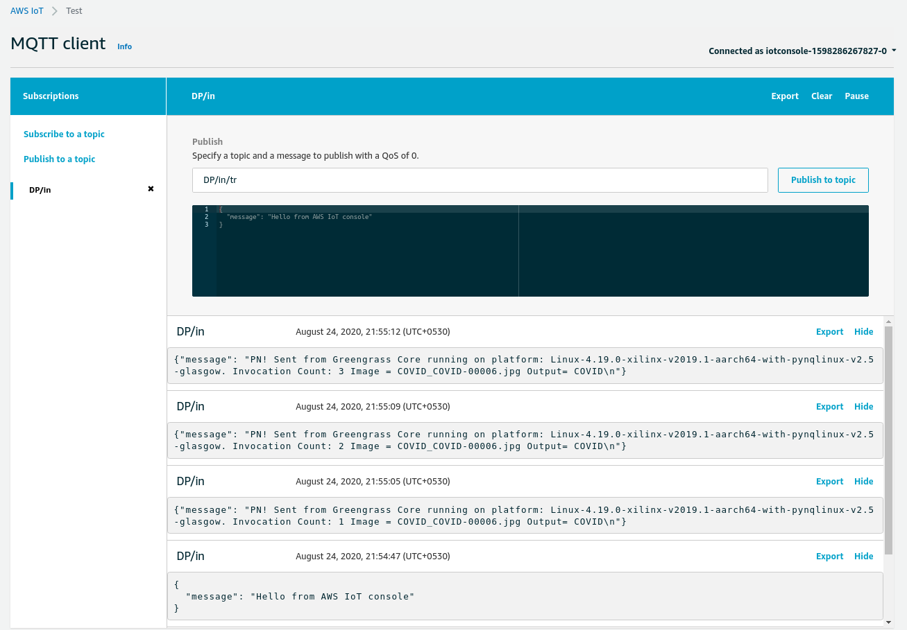
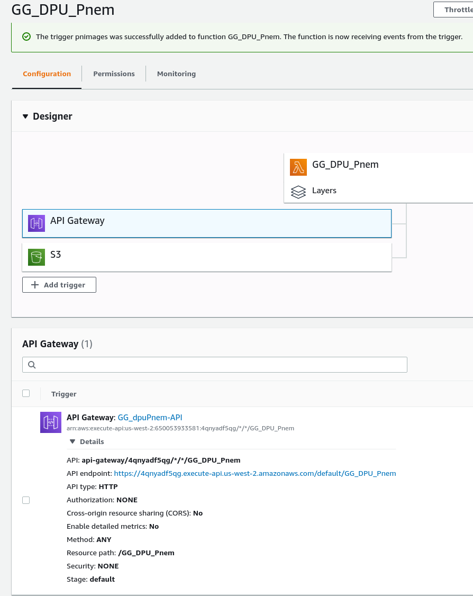

<div style="page-break-after: always;"></div>
<table style="width:100%">
  <tr>
    <th width="100%" colspan="6"><h1>Getting Started Guide: Pneumonia and COVID-19 Detection from X-Ray Images using ZCU104 as Edge Device</h1>
</th>
  </tr>
</table>
</div>

<div align="left">
  
</div>

**Author**: Syed Hussain (hsyed@spline.ai)\
**SplineAI Tech Private Ltd** (https://www.spline.ai) \
**Date**: 01 June 2020

# AWS IoT Greengrass
AWS IOT [Greengrass](https://docs.aws.amazon.com/greengrass/latest/developerguide/gg-gs.html) is an integrated software platform that extends the cloud capabilities to the Local devices and Edge devices. This enables the application to collect and analyze the data closer to the source, react to the local events, run machine learning inference and communicate securely to other devices in the local network. Developers can use AWS Lambda functions to develop complex applications that trigger the inference in Edge Device  and connect with other AWS resources like S3, DynamoDB. \
An AWS [IoT Greengrass core](https://docs.aws.amazon.com/greengrass/latest/developerguide/gg-core.html) is an IOT thing (or device) that acts as a hub or gateway in Edge environment. The core device runs the AWS IoT Greengrass Core software, which manages the local processes for Greengrass groups
The Basic Architecture of AWS IoT Greengrass is shown in the figure below:

<div align="center">
  
</div>

**AWS Lambda Function** \
AWS Lambda function enables the users to develop applications to run in the Cloud without provisioning or managing the servers. Users only pay for the compute time and the resources it consumes. Lambda function executes the code based on events generated by other AWS resources or user applications.

The developer guides on IoT Green Grass and Lambda function are given in the links: [Greengrass](https://docs.aws.amazon.com/greengrass/latest/developerguide/gg-gs.html) and [Lambda Function](https://docs.aws.amazon.com/lambda/latest/dg/lambda-dg.pdf)
<div align="center">
  
</div>

# ZCU104 as Edge Device in IoT Greengrass
Xilinx Zynq UltraScale+ MPSoC ZCU104 is a powerful FPGA device from Xilinx that enables designers to develop designs for embedded vision applications, machine learning, Augmented Reality (AR), Drones and Medical Imaging. The device ZCU104 with [PYNQ OS](http://www.pynq.io/board.html) is qualified to be an Edge device under AWS IoT Greengrass platform. However, users need to prepare the device with (1) additional python3.7 packages in PYNQ and (2) Environment Setup for Greengrass.   
 
**ZCU104 Setup with python3.7** \
The ZCU104 device with PYNQ uses python3.6 as default with python3.7 optionally available. To use the Greengrass IoT Core latest version [GGC v10.0](https://docs.aws.amazon.com/greengrass/latest/developerguide/gg-core.html) we opted for the python3.7 version in the ZCU104 edge device. \
To make the ZCU104 ready to run the Greengrass Core software we follow the steps below:

1. Install python3.7 dev libraries \
$sudo apt install libpython3.7-dev python3.7-dev

2. Make python3.7 as the primary python version in ZCU104 device
```
$cd /usr/local/bin
$sudo unlink python3
$sudo unlink python3-config
$sudo unlink python3m
$sudo unlink python3m-config
$sudo ln -s python3.7 python3
$sudo ln -s python3.7-config python3-config
$sudo ln -s python3.7m python3m
$sudo ln -s python3.7m-config python3m-config
```


3. Install pip3 for python3.7 using get-pip.py
```
$cd ~xilinx
$curl https://bootstrap.pypa.io/get-pip.py -o get-pip.py
$sudo python3.7 get-pip.py
$pip3 -V
pip 20.1.1 from /usr/local/lib/python3.7/dist-packages/pip (python 3.7)
$sudo pip3 install --force-reinstall numpy
$sudo pip3  install cffi
```


4. Install DPU_PYNQ for python3.7
```
$git clone --recursive https://github.com/Xilinx/DPU-PYNQ
$cd DPU-PYNQ/upgrade
$make
$cd ../
$sudo pip3 install pynq-dpu
```
Post installation of DPU-PYNQ for python3.7 two modification in dpu.py file is required to make it run under python3.7
Open the file /usr/local/lib/python3.7/dist-packages/pynq_dpu/dpu.py in some editor and comment the lines at 20 and 248 as follows:

```
#import runner   # At line number 20
#self.runner = runner.Runner(runner_folder)[0]    # At line number 248
```

After the DPU_PYNQ installation is done the validity of the installation can be done by te folowing python command:
$sudo python3.7 -c 'from pynq_dpu import DpuOverlay ; overlay = DpuOverlay("/home/xilinx/jupyter_notebooks/pynq-dpu/dpu.bit")'


5. Create link of /bin/cp and /bin/grep to /usr/bin
```
$sudo ln -s /bin/cp /usr/bin/cp
$sudo ln -s /bin/grep /usr/bin/grep
```

The above steps will make the ZCU104 device ready to be installed the Greengrass core software GGC v10.0.
OpenCV is a pre-requisite to run the dputils library that enables DPU utiity to be used for machine learning with images. The detailed discussion on installing OpenCV can be found [here] (https://gist.github.com/schelleg/40fb06238709ece43c52cfc770860e20). The script [opencv_install.sh](DPU_Lambda/opencv_install.sh) can be used to install OpenCV 4.2.0 with python3.7. 
6. Install the OpenCV 4.4.0 for python3.7
```
$chmod +x opencv_install.sh
$./opencv_install.sh zcu104
$cd opencv-4.2.0/build/python_loader
$sudo python3 setup.py install
```

After the above steps we can make the python3 to link python3.6 following the similar steps presented in (2). The Greengrass IoT Core software launches all the lambda functions in the device using /usr/bin/python3.7 call. The above steps make the ZCU104 device with PYNQ OS ready for Greengrass Core software GGC v1.10. 

**Installing AWS IoT Greengrass Core Software GGC v1.10 in ZCU104** \
We follow the steps below to make ZCU104 to communicate with AWS Cloud seamlessly to deploy the IoT Greengrass tasks.

1. Configure AWS with "us-west-2" as the default region
```
$aws configure
(Provide the inputs AWS_ACCESS_KEY_ID, AWS_SECRET_ACCESS_KEY and region)
```


2. Save the following aliases (after replacing the actual AWS data) into .bashrc file to be used during AWS Greengrass Core software installation steps
```
export AWS_ACCESS_KEY_ID=<aws-access-id-key>
export AWS_SECRET_ACCESS_KEY=<aws-secret-access-key>
export AWS_DEFAULT_REGION=us-west-2
export AWS_REGION=us-west-2
```


3. Install the AWS Command Line utility with version 2+ 
```
$curl "https://awscli.amazonaws.com/awscli-exe-linux-aarch64.zip" -o "awscliv2.zip"
$unzip awscliv2.zip
$sudo ./aws/install
$sudo ./aws/install -i /usr/local/aws-cli -b /usr/local/bin --update
```


4.  Create the ggc_user and ggc_group system accounts
```
$sudo adduser --system ggc_user
$sudo addgroup --system ggc_group
```


5. AWS IoT Greengrass Core software Installation through Device setup \
An AWS [IoT Greengrass core](https://docs.aws.amazon.com/greengrass/latest/developerguide/gg-core.html) is an AWS IoT thing (device) that acts as a hub or gateway in edge environments. The core device runs the AWS IoT Greengrass Core Software, which enables it to manage local processes for Greengrass Groups, shadow Sync, and token exchange. \
The Greengrass setup is a script that installs the core device by running a single script [gg-device-setup-latest.sh](https://docs.aws.amazon.com/greengrass/latest/developerguide/quick-start.html). Quick installation steps are given in the [AWS documentation](https://docs.aws.amazon.com/greengrass/latest/developerguide/quick-start.html).

Download and start the script. You can use wget or curl to download the script 
```
$wget -q -O ./gg-device-setup-latest.sh https://d1onfpft10uf5o.cloudfront.net/greengrass-device-setup/downloads/gg-device-setup-latest.sh && chmod +x ./gg-device-setup-latest.sh && sudo -E ./gg-device-setup-latest.sh bootstrap-greengrass-interactive
```

This step requires the following inputs: AWS access key ID, AWS secret access key and AWS session token. Here, the user need to press "Enter" to allow the default information as inputs. The other two important information are Greengrass Group name and Greengrass Core name. For example, user can choose the names as 'GreenGrass_pynq_Group' and 'GreenGrass_pynq_Core'. The following picture shows the messages from the Device setup:

<div align="left">
  
</div>


The following figure shows the interaction between AWS IoT Core and Core Device with the installed AWS IoT Greengrass Core software.

<div align="left">
  
</div>

The above installation steps creats a Greengrass Group with name "GreenGrass_pynq_Group" and Core Device with name "GreenGrass_pynq_Core". It also create a "Hello World" Lambda function shown in the above figure. In the following step we'll creat a Lambda function that runs the inference for Pneumonia and COVID prediction through MQTT Trigger.

# Lambda Function for Running Pneumonia/COVID Prediction on ZCU104 as Edge Device
Here, we follow the steps provided in AWS [Greengras Documentation](https://docs.aws.amazon.com/greengrass/latest/developerguide/lambda-functions.html) to develop and a Lambda Function that runs the inference on ZCU104 as Edge Device in IoT Greengrass. 
1. **Install boto3 in ZCU104**
Boto3 is the Amazon Web Services (AWS) Software Development Kit (SDK) for Python. To install it run: \
$sudo pip3 install boto3

2. **Install Greengrass Core Python SDK:** \
The AWS IoT [Greengrass Core Python SDK](https://github.com/aws/aws-greengrass-core-sdk-python/) is meant to be used by AWS Lambda functions running on an AWS IoT Greengrass Core. It also enables Lambda functions to invoke other Lambda functions deployed to the Greengrass Core, publish messages to the Greengrass Core and work with local Shadow service. 
```
$cd ~xilinx
$git clone --recursive https://github.com/aws/aws-greengrass-core-sdk-python.git
$cd aws-greengrass-core-sdk-python
$sudo pip3 install -r requirements.txt 
$sudo python3 setup.py install
```


3. **Creating GG_DPUPnem lambda function through AWS Lambda Console:** \
In this step, user can load the example Lambda function DPU_Pnem.py through [AWS Lamda Console](https://us-west-2.console.aws.amazon.com/lambda). The steps for this part is given in [Create and package the Lambda function](https://docs.aws.amazon.com/greengrass/latest/developerguide/package.html). The command creates the zip file for uploading is given below:
```
cd ~/COVID-XS/DPU_Lambda
cp -r <Path of aws-greengrass-core-sdk-python>/greengrasssdk
zip -r DPU_Pnem.zip DPU_Pnem.py greengrasssdk
```

    

The above step will create the zip file for uploading to create new Lambda function. The steps are given below: 
```
a. In the Lambda console, choose Create function.
b. Choose Author from scratch. Name your function GG_DPU_Pnem, and set the remaining fields as follows:
       * For Runtime, choose Python 3.7.
       * For Permissions, we created an excution role that includes S3 Permissions for Read/Write. Or, you can follow the steps in Module 3-1 to create the role.
c. Choose Create function.
d. Upload your Lambda function deployment package:
       * On the Configuration tab, under Function code, set the following fields:
            - For Code entry type, choose Upload a .zip file.
            - For Runtime, choose Python 3.7.
            - For Handler, enter GG_DPU_Pnem.function_handler
       * Choose Upload, and then choose DPU_Pnem.zip.
       * At the top of the page, choose Save.
    
e. Publish the first version of the function:
       * From Actions, choose Publish new version. For Version description, enter First version.
       * Choose Publish.
f. Create an alias for the function version:
       * From the Actions menu, choose Create alias, and set the following values:
             - For Name, enter "a1".
             - For Version, choose 1.
       * Choose Create.
g. 
    
    
```


4. **Add Lambda and Configure GG_DPU_Pnem as "Long-lived", "No Container" Lambda function in Greengrass Group** \
In this step we add the Lambda function "GG_DPU_Pnem" to Greengrass Group 'GreenGrass_pynq_Group' as "No Container", "Long-lived" function running under root. Here we follow the steps given [Greengrass Documentation](https://docs.aws.amazon.com/greengrass/latest/developerguide/long-lived.html). \
a. The Lambda function GG_DPU_Pnem is added to the Greengrass group. The configuration of GG_DPU_Pnem is available [here](../doc/images/GG_Lambda_Runtime_Setting.png) \
b. To run the inference for COVID Prediction with 150x150 resized X-Ray images we use the following environment variables.
<div align="left">
  
</div>
    
5. **"Add Subscriptions" to the Greengrass group** \
Add two subscription to the Greengrass group as shown in the following figure
<div align="left">
  
</div>
    

6. **Deploy the Greengrass Group** \
After the Adding the subscriptions the Group to deployed by selecting the menu option "Action -> Deploy". Once the group successfully deployed the ZCU104 device will show a running process similar to: \
root     17753 42.0  3.6 622964 74144 pts/0    Ssl+ 16:24   0:02 /usr/bin/python3.7 -u /greengrass/ggc/packages/1.10.2/runtime/python/lambda_runtime.py --handler=DPU_Pnem.function_handler


7. **Test the Greengrass Group** \
To Test the Greengrass group the steps click on the item "Test" under "AWS IoT" Console. Then provide the Subscription topic "DP/in" and Select "Display payloads as strings (more accurate)" option. Press the button "Subscribe To Topic". The following figure shows the above steps: 
<div align="left">
  
</div>
    
Next, provide "Dp/in/tr" for the input of "Publish to Topic". Press the button "Publish to Topic". This will show the following output in the IoT Console: 
<div align="left">
  
</div>
    
The above figure shows that the Lambda function is running to the Local Device ZCU104 to correctly predict the input X-Ray image "COVID_COVID-00006.jpg" as COVID. 
    
7. **Running Lambda function using S3 and AWS API as Trigger**    
The Lambda function DP_PU_Pnem is attached with two Triggers shown in the following Figure.
<div align="left">
  
</div>
    
    
    
