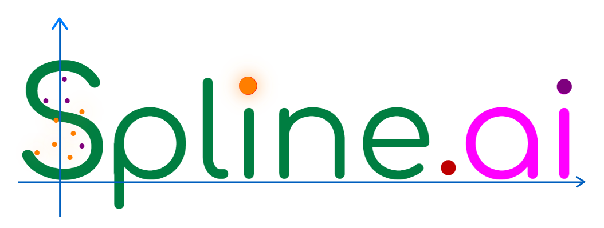
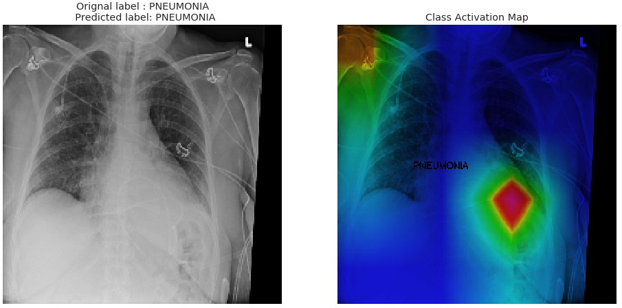
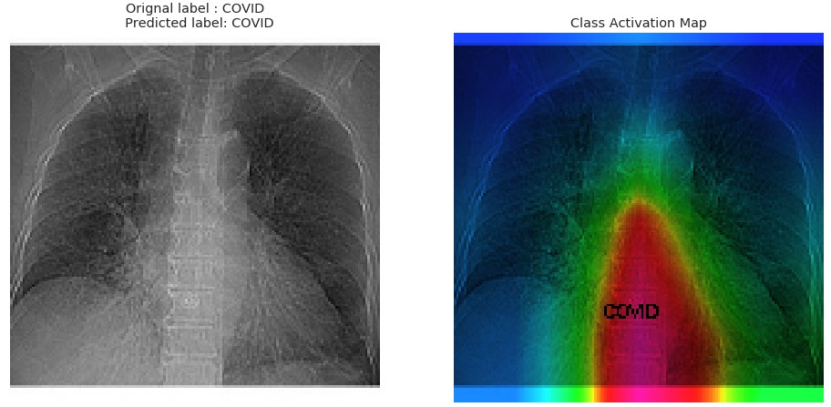
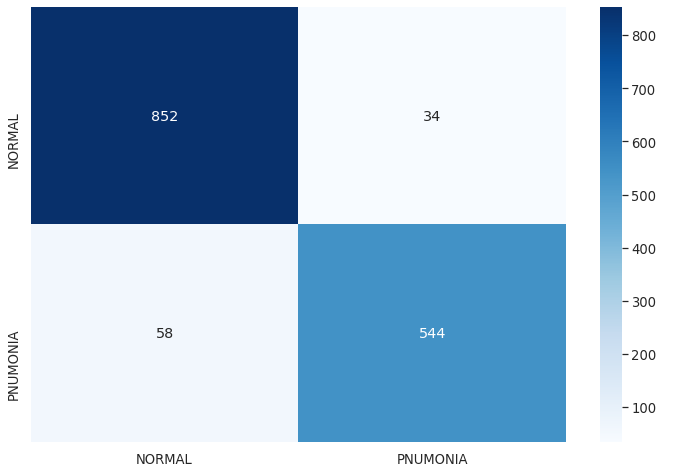
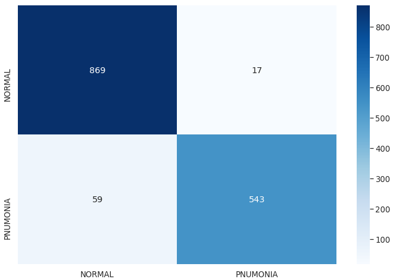
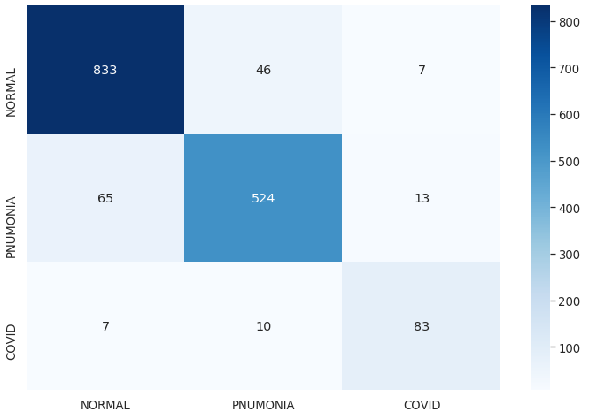

<div style="page-break-after: always;"></div>
<table style="width:100%">
  <tr>
    <th width="100%" colspan="6"><h1>Pneumonia and COVID-19 Detection from X-Ray Images using Vitis-AI and Deployed by IoT GreenGrass</h1>
</th>
  </tr>
</table>
</div>

<div align="left">
  
</div>

**Author**: Syed Hussain (hsyed@spline.ai)\
**SplineAI Tech Private Ltd** (https://www.spline.ai) \
**Date**: 01 June 2020

# Introduction
 
Coronavirus or COVID-19 Pandemic is an extraordinary Emergency Healthcare crisis in recent time with large numbers of fatalities and longterm Health issue. The COVID-19 Pandemic also seriously hampered the social life and damaged the economy of almost 200 countries. Growing cooncern is that it'll remain major Healthcare issue moving forward to the year 2021. Currently, the widely used test method to detect COVID-19 is RT-PCR or Real-Time Polymerase Chain Reaction. Although RT-PCR is a standard diagnostic technique, it also has many drawbacks. RT_PCR has shown high-rates of false negatives, its process is time-consuming and costly. During this crisis, from many experiments, it has been found that Pneumonia and COVID-19 infection detection from the imaging e.g. CT Scan and X-Ray is very effective and produces greater insights. However, compared to CT Scan or Computed Tomography the use of Chest X-Ray imaging is much cheaper and less efficient. 

We have developed a smart and scalable solution for Pneumonia and COVID-19 prediction system using [Vitis-AI](https://developer.xilinx.com/en/get-started/ai.html) and [AWS-IoT GreenGrass](https://aws.amazon.com/greengrass/) with Xilinx [ZCU104](https://www.xilinx.com/products/boards-and-kits/zcu104.html#hardware) FPGA board as the Edge Device. This makes the solution highly scalable, extremely cheaper and mobile suitable for use in any Hospitals, Ambulance or Hospital-in-Wheels. However, our solution is not a production-ready solution, it primarily meant for helping Healthcare researchers to develop a radiology flow for better and seamless diagnosis of COVID-19.


The COVID-XS open source directory has the following resources: 

# Directory Listing

Directory                        | Description
:--------------------------------|--------------------------------
code                             | Containing the python source code for the following (1) to train the four High performing Deep Learning models in Vitis-AI conda tensrflow environment, (2) to help prepare Pneumonia and COVID datasets (3) Quantization/Compilation of Deep Learning models for the Edge Device ZCU104 
compile | Containing the output of Compilation steps that converts the Quantized Tensorflow model to Object model for running inference in ZCU104 FPGA
dataset | This directory saves the Pneumonia data set from RSNA and COVID-19 data set from the open source respositories 
doc     | Contains the images using in this documentation
*.sh    | Script files automating the steps (1) train the Deep Learning models, (2) Quantize and (3) Compile for ZCU104
COVID_demo        | Contains the ipynb files to demonstrate the accuracy of Deep Learning models and draw heatmap on Pneumonia/COVID-19 cases
COVID_DPU_demo    | Contains the ipynb files to demonstrate the inference of Pneumonia/COVID-19 Deep Learning models in ZCU104 FPGA
DPU_Edge          | Contains the AWS Lambda functions for deplying the Pneumonia/COVID-19 prediction inference in Edge Device through IoT Greengrass 


# Important Document Links
In this note we have used the reference of the following other Documents: \

Document                         | Link
:--------------------------------|--------------------------------
[Vitis AI stack release 1.1](https://github.com/Xilinx/Vitis-AI)       |   https://github.com/Xilinx/Vitis-AI
[Vitis AI User Guide UG1414 v1.1](https://www.xilinx.com/support/documentation/sw_manuals/vitis_ai/1_1/ug1414-vitis-ai.pdf)  | https://www.xilinx.com/support/documentation/sw_manuals/vitis_ai/1_1/ug1414-vitis-ai.pdf
[Vitis AI Evaluation board - ZCU104](https://www.xilinx.com/products/boards-and-kits/zcu104.html#hardware) | https://www.xilinx.com/products/boards-and-kits/zcu104.html#hardware 
[ZCU104 PYNQ 2.5 image file](http://www.pynq.io/board.html) | http://www.pynq.io/board.html
[Document for Compiled Model to run in DPU (Deep Learning Processing Unit)](https://github.com/Xilinx/Vitis-AI/tree/master/DPU-TRD) | https://github.com/Xilinx/Vitis-AI/tree/master/DPU-TRD
[DPU-PYNQ Libray](https://github.com/Xilinx/DPU-PYNQ) | https://github.com/Xilinx/DPU-PYNQ
[AWS IoT Greengrass Getting started Guide](https://docs.aws.amazon.com/greengrass/latest/developerguide/gg-gs.html) | https://docs.aws.amazon.com/greengrass/latest/developerguide/gg-gs.html
[Module 2: Installing the AWS IoT Greengrass Core software](https://docs.aws.amazon.com/greengrass/latest/developerguide/module2.html) | https://docs.aws.amazon.com/greengrass/latest/developerguide/module2.html 
[Module 3 (part 1): Lambda functions on AWS IoT Greengrass](https://docs.aws.amazon.com/greengrass/latest/developerguide/module3-I.html) | https://docs.aws.amazon.com/greengrass/latest/developerguide/module3-I.html
[SageMakeNeo](https://docs.aws.amazon.com/sagemaker/latest/dg/neo.html) | https://docs.aws.amazon.com/sagemaker/latest/dg/neo.html


# Deep Learning Models

We have provided two sets of Deep Learning models for predicting Pneumonia and COVID-19 from Chest X-Rays: 
  1) Pnem1 - Pneumonia Detection model for 150x150 image dimension 
  2) Pnem2 - Pneumonia Detection model for 224x224 image dimension 
  3) Pnem3 - Pneumonia and COVID-19 Detection model for 150x150 image dimension 
  4) Pnem4 - Pneumonia and COVID-19 Detection model for 224x224 image dimension 

The Pneumonia and COVID-19 detection models uses the input images of dimension 150x150 and 224x224. The following figurre shows the prediction output from the two Deep Learning models:

<div align="center">
  
</div>

<div align="center">
  
</div>

# Pre-requisites

- An Ubuntu 16.04 host PC with preferably Deep Learning capable GPU or Powerful CPUs;

- [Vitis AI stack release 1.1](https://github.com/Xilinx/Vitis-AI) from [www.github.com/Xilinx](https://www.github.com/Xilinx). In particular, refer to the [Vitis AI User Guide UG1414 v1.1](https://www.xilinx.com/support/documentation/sw_manuals/vitis_ai/1_1/ug1414-vitis-ai.pdf) for the installation guidelines and note that you need to download the two containers available from [docker hub](https://hub.docker.com/r/xilinx/vitis-ai/tags)

- Vitis AI Evaluation board [ZCU104](https://www.xilinx.com/products/boards-and-kits/zcu104.html#hardware) with [ZCU104 PYNQ 2.5 image file](http://www.pynq.io/board.html)
which contains a pre-built working design for the ZCU104 with the [DPU-v2](https://github.com/Xilinx/Vitis-AI/tree/master/DPU-TRD). This pre-built pynq image requires manual upgrade folloing the instructions given [here](https://github.com/Xilinx/DPU-PYNQ/tree/master/upgrade). Users to follow the steps below:
  * download the official 2.5 image.
  * run the makefile as instructed in https://github.com/Xilinx/DPU-PYNQ#1-upgrading-the-pynq-v25-image
  * pip install pynq-dpu as in https://github.com/Xilinx/DPU-PYNQ#2-install


- Once the base PYNQ Linux image is installed, the user to follow the [AWS IoT Greengrass Getting started Guide](https://docs.aws.amazon.com/greengrass/latest/developerguide/gg-gs.html) for details for integration with Edge Device.

- Familiarity with CNN and Deep Learning principles.
- Familiarity with Quantization of Deep Learning Models. 
- Familiarity with Compiled Model for running in [DPU](https://github.com/Xilinx/Vitis-AI/tree/master/DPU-TRD).


### Install Missing Packages on the Vitis AI Tools Container

This application requires some packages that were not included in the VAI tools container. OpenCV >= 4.0 requires only if users want to display the Heatmaps presented in COVID_demo folder. 
Here are the steps following [Vitis-AI](https://github.com/Xilinx/Vitis-AI) to include such packages:
```bash
./docker_run.sh xilinx/vitis-ai-gpu:latest # enter into the docker VAI tools image
sudo su # you must be root
conda activate vitis-ai-tensorflow # as root, enter into Vitis AI TF (anaconda-based) virtual environment
conda install -c conda-forge pydicom
conda install -c anaconda xlrd
conda deactivate
exit # to exit from root
conda activate vitis-ai-tensorflow # as normal user, enter into Vitis AI TF (anaconda-based) virtual environment
```
Note that if you exit from the current Docker Vitis AI tools image you will lose all the installed packages, so to save all changes in a new docker image open a new terminal and run the following commands:

```bash
sudo docker ps -l # To get the Docker CONTAINER ID
```
you will see the following text (the container ID might have a different number):
```text
CONTAINER ID        IMAGE                        COMMAND                CREATED             STATUS              PORTS               NAMES
7f865e2ddd33        xilinx/vitis-ai-gpu:latest   "/etc/login.sh bash"   something           something                          ecstatic_kirch
```
now save the modified docker image:
```bash
sudo docker commit -m "new image: added pydicom and xlrd used in data generation" \
        7f865e2ddd33        xilinx/vitis-ai-gpu:latest
```


# Pneumonia and COVID dataset preparation

Organize the data into folders, such as ``train`` for training, ``val`` for validation during the training phase, ``test`` for testing during the inference/prediction phase, and ``cal`` for calibration during the quantization phase, for each dataset. The ./dataset/Pneumonia/ contains the training data for Pneumonia Combined with COVID dataset, Calibration dataset for Quantization process. The details of generating the dataset for training Pneumonia and COVID models are presented [here](./dataset/README.md).
From the list of open source COVID-19 datasets we found nearly 400 unique X-Ray images after removing the duplicate entries. 

The data distribution for NORMAL and PNEUMONIA used for Pneumonia model Pnem1 and Pnem2 training:
```text
RSNA              NORMAL      PNEUMONIA  
===================================================
train             7080        4809        
test              885         601   
val               886         602  
```

The data distribution for NORMAL, PNEUMONIA and COVID cases used for COVID model Pnem3 and Pnem4 training:
```text
RSNA              NORMAL      PNEUMONIA    COVID
===================================================
train             7080        4809         260
test              885         601          100
val               885         601          100
```

# The Main Flow

The main flow is consists of seven steps. The first five steps are executed from the Vitis-AI 1.1 tools container on the host PC by launching the five scripts with prefixed 1 to 5 or running a single script [run_all.sh](./run_all.sh). The 6th step to be done on the target ZCU104 board with pre-installed PYNQ image.
Details of the steps are given below:

1. Train the Keras CNNs Models for Pneumonia to generate the HDF5 weights. Run this command on the Vitis-AI container:
```
source ./1_Pneumonia_train.sh  #For traing the two Pneumonia models Pnem1 and Pnem2
source ./1_COVID_train.sh  #For traing the two COVID models Pnem3 and Pnem4. 
#This script should be tried after completing the training for Pnem1 and Pnem2. 
#The two COVID detection models Pnem3 and Pnem4 uses the weights generated in Pnem1 and Pnem2 to further fine-tune for detecting COVID.
```
2. Convert into TF checkpoints and inference graphs. From the host PC, run the following  commands:
```
source ./2_keras2tf.sh   
```
3. Freeze the TF graphs and evaluate the Pneumonia/COVID prediction accuracy for the [./dataset/Pneumonia/covid_data/test/]. From the host PC, run the following commands:
```
source ./3a_freeze.sh     
source ./3b_evaluate_frozen_graph.sh 
```

4. Quantize from 32-bit floating point to 8-bit fixed point and evaluate the prediction accuracy of the quantized CNN. This uses the same dataset mention in previous step. From the host PC, run the following commands:
```
source ./4a_quantization.sh
source ./4b_evaluate_quantized_graph.sh 
```

5. Compile the Quantized model and generate the ``elf`` file for the target board. From the host PC, run the following commands:
```
source ./5_compile.sh 
```

6. Copy the generated elf file into the [./COVID_DPU_demo/models] directory. Copy the COVID_DPU_demo directory. Use the generated ``elf`` file on the ZCU104 target board to measure the fps and accuracy. From the target board, run the following command:
```
source ./copy_elfs.sh   #To copy the Model elfs file in the directory ./COVID_DPU_demo/models
scp -r COVID_demo xilinx@<IP-of-the-ZCU104-Board>:/home/xilinx/jupyter_notebooks/pynq-dpu/
```

# Pneumonia and COVID-19 Models 
We have trained the Pneumonia model Pnem1 and Pnem2 for 300 epochs using batch size 64. We used the AWS instance p3.x2large machine for training the models. The accuracy of Pneumonia prediction for both the models is > 94%. The Classification reports and Confusion matrix of the models are shown below:

### 1. Performance of the model [Pnem1](./doc/images/bd_Pnem1.png)  
Pneumonia prediction Model with input dimension 150x150
#### Classification Reports of Pnem1
```text
                   precision    recall    f1-score   support
==============================================================
      NORMAL       0.94         0.96      0.95       886
   PNEUMONIA       0.94         0.90      0.92       602

   micro avg       0.94         0.94      0.94       1488
   macro avg       0.94         0.93      0.94       1488
weighted avg       0.94         0.94      0.94       1488
 samples avg       0.94         0.94      0.94       1488
==============================================================
```

#### Confusion Matrix of Pnem1
<div align="left">
  
</div>


### 2. Performance of the model [Pnem2](./doc/images/bd_Pnem2.png)  
Pneumonia prediction Model with input dimension 224x224
#### Classification Reports of Pnem2
```text
                   precision    recall    f1-score   support
==============================================================
      NORMAL       0.94         0.98      0.96       886
   PNEUMONIA       0.97         0.90      0.93       602

   micro avg       0.95         0.95      0.95       1488
   macro avg       0.95         0.94      0.95       1488
weighted avg       0.95         0.95      0.95       1488
 samples avg       0.95         0.95      0.95       1488
==============================================================
```
#### Confusion Matrix of Pnem2
<div align="left">
  
</div>


### 3. Performance of the model [Pnem3](./doc/images/bd_Pnem3.png)  
Pneumonia prediction Model with input dimension 150x150
#### Classification Reports of Pnem3
```text
                   precision    recall    f1-score   support
==============================================================
      NORMAL       0.93         0.96      0.94       886
   PNEUMONIA       0.92         0.89      0.91       602
       COVID       0.91         0.80      0.85       100

   micro avg       0.92         0.92      0.92       1588
   macro avg       0.92         0.88      0.90       1588
weighted avg       0.92         0.92      0.92       1588
 samples avg       0.92         0.92      0.92       1588
==============================================================
```
#### Confusion Matrix of Pnem3
<div align="left">
  
</div>


### 4. Performance of the model [Pnem4](./doc/images/bd_Pnem4.png) 
Pneumonia prediction Model with input dimension 224x224
#### Classification Reports of Pnem4
```text
                   precision    recall    f1-score   support
==============================================================
      NORMAL       0.92         0.94      0.93       886
   PNEUMONIA       0.90         0.87      0.88       602
       COVID       0.82         0.83      0.83       100

   micro avg       0.91         0.90      0.91       1588
   macro avg       0.88         0.88      0.88       1588
weighted avg       0.91         0.90      0.91       1588
 samples avg       0.90         0.90      0.90       1588
==============================================================
```
#### Confusion Matrix of Pnem4
<div align="left">
  
</div>

We have developed the four Pneumonia and COVID prediction Deep Learning models with incredibly high Accuracy and Precision. The parameter size of the models is around 34M and can be easily compiled for ZCU104 FPGA. The Compiled models for ZCU104 also maintains a similar performance shown in Host. We have tested the performance of the models Pnem1-4 in DPU. The demo ipynb files to test the models are presented in the folder [COVID_DPU_demo](./COVID_DPU_demo/README.md)

## IoT GreenGrass Integration for Training using SageMaker Neo
[SageMakeNeo](https://docs.aws.amazon.com/sagemaker/latest/dg/neo.html) and VitisAI integration will enable users to easily train the Deep Learning Models and seamlessly deploy the trained models to the ZCU104 Edge Device. 


## IoT GreenGrass Integration for Deployment with ZCU104 as Edge Device
To integrate ZCU104 as Edge Device for Prediction of Pneumonia/COVID-19 the [Getting Started Guide](./DPU_Edge/README.md) may be followed. The detail guidance is available at [AWS Developers guide](https://docs.aws.amazon.com/greengrass/latest/developerguide/gg-gs.html).


