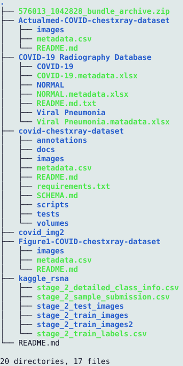

# Generating dataset
This section presents the methology of creation of dataset for training Pneumonia and COVID-19. We use [RSNA dataset](https://www.kaggle.com/c/rsna-pneumonia-detection-challenge) downloaded from Kaggle dataset for training Pneumonia models Pnem1 and Pnem2.
The X-Ray image for COVID-19 is collected from multiple emerging open sources repositories mentioned in the following sections below. We have taken care to eliminate the duplicate images in the final generated COVID-19 dataset. We finally combine the RSNA dataset and COVID-19 dataset to create the final dataset ./covid_data to train the COVID detection models Pnem3 and Pnem4. 

## Datasets:
Users can download data from various emerging open source COVID-19 X-Ray image repositoris or use propreitory datsets from Hospitals. In our work we have accessed the COVID-19 X-Ray images from the following sources: \
1) Pneumonia - https://www.kaggle.com/c/rsna-pneumonia-detection-challenge \
2) COVID-19 - https://github.com/ieee8023/covid-chestxray-dataset \
3) COVID-19 - https://github.com/agchung/Figure1-COVID-chestxray-dataset \
4) COVID-19 -https://github.com/agchung/Actualmed-COVID-chestxray-dataset \
5) COVID-19 -https://www.kaggle.com/tawsifurrahman/covid19-radiography-database \

## Generating Dataset:
Create the following directories: ./src, ./input and ./output and run the following commands in the ./input directory:
* `git clone https://github.com/ieee8023/covid-chestxray-dataset.git`
* `git clone https://github.com/agchung/Figure1-COVID-chestxray-dataset.git`
* `git clone https://github.com/agchung/Actualmed-COVID-chestxray-dataset.git` 

### Download the following datasets using the links:
* [COVID-19 Radiography database](https://www.kaggle.com/tawsifurrahman/covid19-radiography-database) to download the COVID-19 Radiography database. Only the COVID-19 image folder and metadata file is required. 
* [RSNA Pneumonia Dataset](https://www.kaggle.com/c/rsna-pneumonia-detection-challenge/data)

### The ./input folder can be seen
This is how the data needs to be arranged in the input directory before *.ipynb code from src directory is run:
## Project folder/
### Copy the following files into ./input/ folder:
      * stage_2_detailed_class_info.csv  
      * stage_2_test_images 
      * stage_2_sample_submission.csv   
      * stage_2_train_images  
      * stage_2_train_labels.csv
      * Actualmed-COVID-chestxray-dataset
      * Figure1-COVID-chestxray-dataset
      * covid19-radiography-database
      * covid-chestxray-dataset 

## Run the ipynb files to create the 'rsna_data' dataset for Pneumonia Models Training and 'covid_data' for COVID Models Training
* Run this ./codes/rsna_data_preparation.ipynb into for creating the rsna dataset.
* Run this ./codes/covid_data_preparation.ipynb into for creating the COVID data and create symlink of NORMAL and PNEUMONIA data from 'rsna_data'.

The 'input' directory tree is shown below:

  

